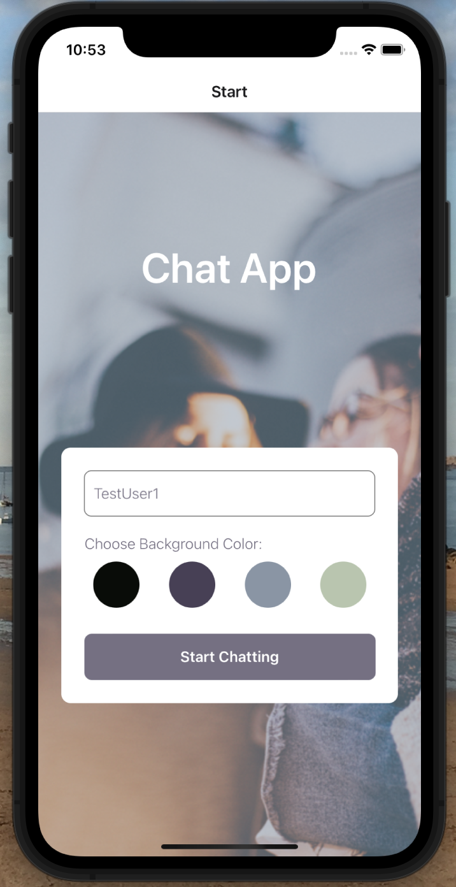
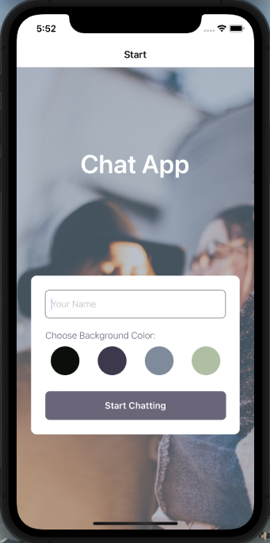
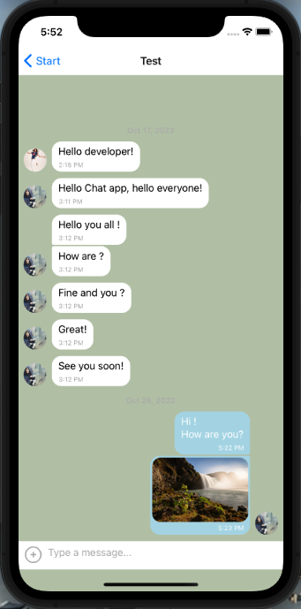

<!--  -->

Chat App

---

# 1. Project description

This App is a **chat app** for mobile devices using **React Native**. The app provides users with a chat interface and options to **share images** and **their location**.

---

# 2. The 5W

1. Who: The users of the mobile chat app. These could be friends, family or other students on this course. Your codebase will be used by other developers working on the product.
2. What: A native chat app built with React Native, as well as all the relevant documentation.
3. When: Whenever users of your chat app want to communicate with each other.
4. Where: The app will be optimized for both Android and iOS devices. You will use Expo to develop the app and Google Firestore to store the chat messages.
5. Why: Mobile chat apps are among the most commonly downloaded and used apps in the world, so knowing how to build a chat app is an indispensable skill. The app will demonstrate your React Native development skills.

---

# 3. How to get the project running

You can run the Project using either Apple XCode simulator, Android Studio or your device.
In order to do so you would need to install Expo CLI (as well as Expo Go in case you want to run directly the App on your device).

- Clone the current repository: `git clone https://github.com/xavsln/chat-app.git`
- Install Expo CLI as a global npm package: `npm install --global expo-cli`
- Install all Project dependecies: `npm install`
- Start the Project: `npm start` or `expo start`
- Follow expo CLI's instructions depending on your preference regarding simulator (Apple XCode simulator, Android Studio or your Expo Go to run the App on your own device)

---

# 4. User stories

- As a new user, I want to be able to easily enter a chat room so I can quickly start talking to my friends and family.
- As a user, I want to be able to send messages to my friends and family members to exchange the latest news.
- As a user, I want to send images to my friends to show them what I’m currently doing.
- As a user, I want to share my location with my friends to show them where I am.
- As a user, I want to be able to read my messages offline so I can reread conversations at any time.
- As a user with a visual impairment, I want to use a chat app that is compatible with a screen reader so that I can engage with a chat interface.

---

# 5. Key features

- A page where users can enter their name and choose a background color for the chat screen before joining the chat.
- A page displaying the conversation, as well as an input field and submit button.
- The chat must provide users with two additional communication features: sending images and location data.
- Data gets stored online and offline.

---

# 6. Technical details

- The app is written in React Native.
- The app is developed using Expo.
- Chat conversations are stored in Google Firestore Database.
- The app authenticates users anonymously via Google Firebase authentication.
- Chat conversations are stored locally.
- The app lets users pick and send images from the phone’s image library.
- The app lets users take pictures with the device’s camera app, and send them.
- The app stores images in Firebase Cloud Storage.
- The app is able to read the user’s location data.
- Location data is sent via the chat in a map view.
- The chat interface and functionality is created using the Gifted Chat library.

---

# 7. Project main dependencies

- "@expo/react-native-action-sheet": "^3.14.0",
- "@react-native-async-storage/async-storage": "^1.17.10",
- "@react-native-community/masked-view": "^0.1.11",
- "@react-native-community/netinfo": "9.3.0",
- "@react-navigation/native": "^6.0.13",
- "@react-navigation/stack": "^6.3.2",
- "core-js": "^3.25.5",
- "expo": "~46.0.13",
- "expo-image-picker": "~13.3.1",
- "expo-location": "~14.3.0",
- "expo-permissions": "~13.2.0",
- "expo-status-bar": "~1.4.0",
- "firebase": "^8.2.3",
- "react": "18.0.0",
- "react-native": "0.69.6",
- "react-native-gesture-handler": "~2.5.0",
- "react-native-gifted-chat": "^1.0.4",
- "react-native-maps": "0.31.1",
- "react-native-reanimated": "~2.9.1",
- "react-native-safe-area-context": "4.3.1",
- "react-native-screens": "~3.15.0",
- "react-navigation": "^4.4.4"

---
